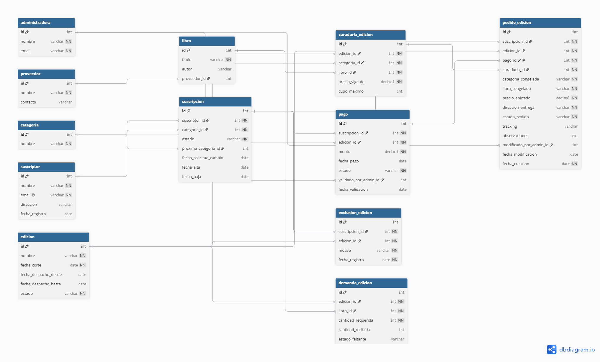

# Especificación del Modelo de Datos (DER) — Proyecto Cajas Literarias

## Introducción

Este documento contiene el Diagrama de Entidad-Relación (DER) realizado para modelar los datos del proyecto Cajas Literarias del Trabajo Final Integrador (TFI). El modelo se centra en el recorrido definido con ayuda del tutor: edición → suscripción → cambios antes/después del corte → pago validado → cierre → padrón congelado → demanda → recepción/faltantes.

La decisión principal que organiza esta etapa de modelado es la separación entre las entidades `Suscripcion` y `PedidoEdicion`, ya que la primera es una entidad mutable que representa la relación vigente entre un suscriptor y una temática, mientras que la segunda es un snapshot inmutable generado únicamente para las suscripciones que, al momento del corte mensual (día 21), cuenten con pago validado. Realizar esta separación permite que la suscripción pueda ser modificada entre cada una de las ediciones (altas, bajas, pausas, cambios de temática) sin que el historial ya congelado se vea afectado. Además, esto logra evitar que un pedido que no fue incluido en una edición sea arrastrado de forma automática a la edición siguiente.

---

## Entidades y Atributos

| Entidad | Descripción | Atributos |
|---|---|---|
| Suscriptor | Persona que se suscribe a una o más cajas temáticas. | id, nombre, email (único), direccion, fecha_registro |
| Administradora | Rol interno de la emprendedora; valida pagos y gestiona stock/despacho. | id, nombre, email |
| Categoria | Línea temática fija de las cajas (una de las 4 disponibles). | id, nombre (Misterio/Terror, Romance, Narrativa/Drama, Sorpresa) |
| Libro | Título curado que puede integrar una caja en alguna edición. | id, titulo, autor, proveedor_id |
| Proveedor | Proveedor de libros/insumos para el cálculo de compras. | id, nombre, contacto |
| Edicion | Ciclo mensual único de la suscripción, con su fecha de corte y ventana de despacho. | id, nombre, fecha_corte, fecha_despacho_desde, fecha_despacho_hasta, estado (abierta/cerrada) |
| CuraduriaEdicion | Tabla intermedia que asigna a cada edición mensual sus 4 categorías con el libro curado y el precio vigente de ese mes, y la cantidad máxima de suscriptores que pueden asignarse a esa temática en esa edición. | id, edicion_id, categoria_id, libro_id, precio_vigente, cupo_maximo |
| Suscripcion | Relación vigente y mutable entre un suscriptor y una temática; vive independiente del ciclo mensual y registra la vigencia de cambios solicitados. | id, suscriptor_id, categoria_id, estado (activa/pausada/baja), proxima_categoria_id, fecha_solicitud_cambio, fecha_alta, fecha_baja |
| Pago | Registro de pago de una suscripción para una edición puntual, con su estado de validación. | id, suscripcion_id, edicion_id, monto, fecha_pago, estado (pendiente/validado), validado_por_admin_id, fecha_validacion |
| PedidoEdicion | Snapshot inmutable generado al corte para las suscripciones con pago validado; congela categoría, libro, precio y dirección de esa edición. | id, suscripcion_id, edicion_id, pago_id, curaduria_id, categoria_congelada, libro_congelado, precio_aplicado, direccion_entrega, estado_pedido (pendiente_de_empaque/empaquetado/despachado/entregado), tracking, observaciones, modificado_por_admin_id, fecha_modificacion, fecha_creacion |
| ExclusionEdicion | Tabla hermana de `PedidoEdicion`: registra, de forma trazable, las suscripciones activas que NO ingresaron a una edición en el corte, ya sea por no contar con pago validado o por no tener curaduría cargada para su categoría en esa edición. | id, suscripcion_id, edicion_id, motivo (sin_pago/pago_pendiente/sin_curaduria), fecha_registro |
| DemandaEdicion | Cálculo agregado de demanda por libro/insumo para una edición, usado para detectar faltantes. | id, edicion_id, libro_id, cantidad_requerida, cantidad_recibida, estado_faltante (sin_faltante/faltante) |

## Relaciones y Cardinalidad

| Relación | Cardinalidad | Regla de negocio |
|---|---|---|
| Suscriptor - Suscripcion | 1 — N | Un suscriptor puede tener historial de suscripciones (altas/bajas repetidas, distintas categorías). |
| Categoria - Suscripcion | 1 — N | Cada suscripción pertenece a una temática vigente. Antes de confirmar un alta o un cambio de temática, el sistema valida que la cantidad de suscripciones activas vigentes para esa categoría en la edición actualmente abierta sea menor al cupo_maximo definido en CuraduriaEdicion. Si el cupo está completo, la acción se rechaza y se informa al suscriptor. |
| Categoria — Suscripcion (próxima) | 1 — N (0..N) | Cambio de temática solicitado después del corte; queda pendiente en proxima_categoria_id sin modificar la categoria_id vigente hasta el próximo ciclo. |
| Edicion - CuraduriaEdicion | 1 — N | Una edición mensual agrupa la curaduría de sus 4 categorías temáticas. |
| Categoria - CuraduriaEdicion | 1 — N | Cada temática tiene su asignación mensual de libro y precio. |
| Libro - CuraduriaEdicion | 1 — N | El libro curado del mes para esa temática. |
| Libro - Proveedor | N — 1 | Cada libro tiene asignado su proveedor para el cálculo de compras. |
| Suscripcion - Pago | 1 — N | Historial de pagos por ciclo mensual de la suscripción. |
| Edicion - Pago | 1 — N | Cada pago corresponde a la edición mensual que se habilita. |
| Administradora - Pago | 1 — N (0..N) | Administradora interna que verifica y valida el comprobante de pago (opcional hasta que se valide). |
| Suscripcion - PedidoEdicion | 1 — N | Solo si el pago fue validado antes del corte (no arrastre: cada edición evalúa la suscripción de forma independiente). |
| Edicion - PedidoEdicion | 1 — N | El padrón congelado de esa edición. |
| Pago - PedidoEdicion | 1 — 1 | El pago validado que habilitó el ingreso a la edición. |
| CuraduriaEdicion - PedidoEdicion | 1 — N | Referencia a la curaduría base que originó el pedido. |
| Administradora - PedidoEdicion | 1 — N (0..N) | Administradora que registra una modificación manual excepcional sobre el snapshot. |
| Suscripcion - ExclusionEdicion | 1 — N | Registra, para trazabilidad, las suscripciones activas que quedaron fuera del corte de una edición, sin arrastrarse de forma automática a la siguiente (igual criterio que PedidoEdicion). |
| Edicion - ExclusionEdicion | 1 — N | Cada exclusión corresponde a la edición en la que se evaluó el corte. |
| Edicion - DemandaEdicion | 1 — N | Cálculo de demanda por libro/insumo para esa edición. |
| Libro - DemandaEdicion | 1 — N | Demanda totalizada por cada título curado en la edición. |

## Notas de Diseño

- **Inmutabilidad y trazabilidad:** `PedidoEdicion` va a ser inmutable a nivel negocio, no de forma técnica, es decir que puede existir una corrección administrativa de forma excepcional, pero esta modificación va a quedar registrada en `observaciones` junto con `modificado_por_admin_id` y `fecha_modificacion`. Además, para evitar que algún cambio futuro en el perfil de un suscriptor o en la curaduría interfieran con el historial de cada edición, `PedidoEdicion` va a conservar como datos propios la dirección de entrega, el precio y el libro/categoría presentes al momento del corte.
- **Redundancia intencional en PedidoEdicion:** al momento del corte, los campos `categoria_congelada`, `libro_congelado` y `precio_aplicado` van a duplicar de forma intencional los datos de `curaduria_id`. Esto va a permitir proteger el histórico frente a correcciones posteriores que pudiesen surgir en `CuraduriaEdicion` (por ejemplo, un ajuste de precio o corrección de datos tras el cierre). Esta copia evita que los cambios se propaguen retroactivamente a todos los pedidos ya cerrados de esa edición. Por lo tanto, `curaduria_id` no se conserva como una fuente de verdad para reconstruir el histórico, sino que actúa únicamente como referencia de trazabilidad hacia el origen del pedido.
- **Garantía de curaduría por restricción:** `CuraduriaEdicion` va a llevar una restricción única compuesta (`edicion_id`, `categoria_id`) con `libro_id` NOT NULL. De esta manera se logra asegurar, a nivel de base de datos, que una edición no pueda duplicar temáticas y que, antes del cierre, existan las cuatro opciones cargadas con su libro correspondiente para evitar pedidos incompletos.
- **Vigencia temporal y transición en datos:** la entidad `Suscripcion` va a incluir `proxima_categoria_id` y `fecha_solicitud_cambio` para poder capturar, a nivel de datos, cualquier cambio solicitado después de la fecha de corte (día 21) sin pisar la temática actual. Cuando se ejecute el corte del ciclo siguiente, el sistema va a promover `proxima_categoria_id` como la nueva `categoria_id` activa y restablecer ambos campos a null, dejando entonces la suscripción limpia para futuros cambios.
- **Idempotencia y no arrastre:** el corte que se realiza el día 21 es una operación idempotente, ya que solo va a tomar `Suscripcion` con estado = activa y con `Pago` estado = validado. Aquellas suscripciones que no cumplen ambas condiciones —ya sea por no tener pago validado, o por estar pausadas o dadas de baja aunque cuenten con un pago cargado— simplemente no generan `PedidoEdicion` en la edición de ese mes y tampoco se arrastran a la edición siguiente de forma automática.
- **Trazabilidad de exclusiones:** además de `PedidoEdicion`, el corte también registra en `ExclusionEdicion` cada suscripción activa que no ingresó a la edición, indicando el motivo (`sin_pago`, `pago_pendiente` o `sin_curaduria`). Esto permite auditar por qué una suscripción quedó afuera sin tener que reconstruirlo cruzando manualmente `Pago` y `CuraduriaEdicion`, y sigue el mismo criterio de no arrastre que `PedidoEdicion`.   
- **Cálculo de stock:** `DemandaEdicion` no es una entidad que se carga a mano, sino que se va a calcular agregando los `PedidoEdicion` de esa edición por libro/insumo.
- **Cupos por temática:** el cupo ocupado de una categoría no se almacena como columna independiente, sino que se calcula dinámicamente contando las `Suscripcion` activas asociadas a esa `categoria_id` mientras la edición correspondiente está abierta (antes del corte). Esta decisión evita inconsistencias entre un contador guardado y el estado real de las suscripciones. La validación del cupo ocurre en el momento del alta o del cambio de temática (no en el corte), rechazando la acción si `cupos_ocupados >= cupo_maximo`. Esto es intencional: se prioriza que el suscriptor conozca la disponibilidad al momento de elegir, en lugar de descubrir recién en el corte que quedó fuera de la edición.  
- **Unicidad de suscriptor por email:** `Suscriptor.email` va a tener una restricción `UNIQUE` a nivel de base de datos. Esto permite que el alta de una suscripción identifique al suscriptor por email de forma automática (find-or-create): si el email ya existe se reutiliza el `Suscriptor` existente, y si no existe se crea uno nuevo, evitando registros duplicados de la misma persona. 

---

## Diagrama UML

---

## Definición de Módulos

A partir del modelo de datos definido, se establecen los siguientes módulos funcionales del sistema, agrupando las entidades del DER según su responsabilidad. La prioridad indicada respeta el criterio de P0: el núcleo obligatorio del proyecto debe concentrarse en suscriptores, suscripciones, edición mensual, corte/padrón, pago simple y preparación/despacho.

| # | Módulo | Entidades del DER involucradas | Prioridad |
|---|---|---|---|
| 1 | Suscriptores | Suscriptor | P0 |
| 2 | Catálogo / Curaduría | Categoria, Libro, Proveedor, CuraduriaEdicion | P0 (prerrequisito de Ediciones) |
| 3 | Ediciones | Edicion | P0 |
| 4 | Suscripciones | Suscripcion (altas, bajas, pausas, cambios, validación de cupo) | P0 |
| 5 | Pagos | Pago | P0 |
| 6 | Cierre / Padrón | PedidoEdicion, ExclusionEdicion (operación de corte idempotente) | P0 - núcleo del recorrido vertical |
| 7 | Stock / Demanda | DemandaEdicion | P0, acotado (sin sistema de compras completo) |
| 8 | Despacho | PedidoEdicion (transición de estados, remito, tracking) | P0 |
| 9 | Administradoras / Autenticación | Administradora | P0 — transversal |
| 10 | Reportes | Agregaciones sobre PedidoEdicion | P1 (nice to have) |
| 11 | Notificaciones | (envío de emails) | P1 (nice to have) |

**Nota:** si bien los módulos 1 a 9 son todos P0, no son independientes entre sí. El recorrido vertical acordado exige que Ediciones, Suscripciones y Pagos estén funcionando antes de poder implementar y probar Cierre/Padrón, ya que esta operación depende de datos generados por los tres módulos anteriores.

---

## Repositorio GitHub

- https://github.com/Emilce97/TFI-CajasLiterarias.git